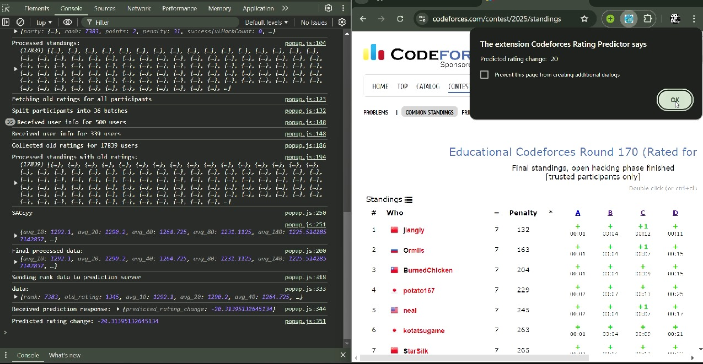

# Codeforces Rating Predictor



A **Codeforces Rating Predictor** that estimates changes in user ratings after a contest. The project utilizes machine learning techniques to analyze performance and predict ratings based on contest standings. The prediction model is integrated into a browser extension for seamless interaction with the Codeforces platform.

## Features

- **Prediction of Rating Changes**: Based on user performance and relative standings in a contest.
- **Machine Learning Model**: Uses Random Forest algorithm optimized with Bayesian optimization.
- **Browser Extension**: Built using HTML, CSS, and JavaScript, allowing users to easily predict rating changes directly on Codeforces.
- **Flask API**: A local server processes the data and returns predictions.

## Table of Contents

- [Project Overview](#project-overview)
- [Technical Stack](#technical-stack)
- [Data Preprocessing](#data-preprocessing)
- [Machine Learning Model](#machine-learning-model)
- [Browser Extension](#browser-extension)
- [Usage](#usage)
- [Setup](#setup)
- [Future Improvements](#future-improvements)
- [License](#license)

## Project Overview

The aim of this project is to predict the rating changes for Codeforces participants after a contest. By analyzing historical data and the standings from a particular contest, the system estimates the relative performance of each participant and provides an accurate prediction of their new rating.

## Technical Stack

- **Programming Languages**: Python, JavaScript
- **Backend**: Flask
- **Frontend**: HTML, CSS, JavaScript
- **Machine Learning**: Random Forest with Bayesian Optimization
- **Data Handling**: NumPy, Pandas
- **Model Deployment**: Flask API on Local Server

## Data Preprocessing

The preprocessing step plays a vital role in this project. The following strategies were employed:

1. **Surrounding Averages**: Compute the average ratings of participants in close ranking positions. This helps determine the relative performance of a participant during a contest.
2. **Feature Engineering**: Various features were created based on past ratings, ranks, and other relevant metrics.
3. **Sorting & Cleaning**: Data was sorted based on old ratings, and any irrelevant or missing data was handled accordingly.

## Machine Learning Model

### Algorithm

- The project uses the **Random Forest** algorithm for prediction. It is an ensemble learning method that aggregates the predictions from multiple decision trees to improve accuracy and robustness.
- **Bayesian Optimization** was used to fine-tune the hyperparameters of the model, ensuring that it provides the most accurate predictions possible.

### Model Evaluation

- Performance was evaluated using metrics like Mean Absolute Error (MAE) and Root Mean Squared Error (RMSE).
- Cross-validation was conducted to ensure the model generalizes well on unseen data.

## Browser Extension

The browser extension was developed using HTML, CSS, and JavaScript. Users can interact with the extension to:
- Select a Codeforces contest.
- Input their handle to get a prediction of their new rating.
- View the results directly within the extension without navigating away from the Codeforces website.

### Features of the Extension

- **User-Friendly UI**: Simple and intuitive design.
- **Real-Time Predictions**: Fetches contest data and sends it to the local server for processing.
- **Integration with Codeforces**: Allows users to see predictions based on live data from the platform.

## Usage

1. **Start the Flask Server**: 
   ```bash
   python app.py
   ```

2. **Use the Browser Extension**:
   - Install the extension by loading the `manifest.json` file in your browser.
   - Navigate to a Codeforces contest page.
   - Open the extension and input your handle.
   - Click on "Predict" to see the rating change estimate.

## Setup

### Prerequisites

- **Python 3.x**
- **Flask**
- **scikit-learn**
- **Pandas**
- **NumPy**
- **Bayesian Optimization Libraries**: e.g., `scikit-optimize`
- **Browser with Extension Support**: Chrome, Firefox, etc.

### Step-by-Step Setup

1. **Clone the Repository**
   ```bash
   git clone https://github.com/yourusername/CF-Rating-Predictor.git
   cd CF-Rating-Predictor
   ```

2. **Install Python Dependencies**
   ```bash
   pip install -r requirements.txt
   ```

3. **Run the Flask API**
   ```bash
   python app.py
   ```

4. **Install the Browser Extension**
   - Go to `chrome://extensions/` (or the equivalent for your browser).
   - Enable "Developer mode".
   - Click on "Load unpacked" and select the `extension/` directory.

5. **Make Predictions**: Open the extension, select a contest, input your handle, and get predictions!

## Future Improvements

- **Model Enhancements**: Integrate more sophisticated algorithms like Gradient Boosting Machines (GBM) or neural networks for better accuracy.
- **Data Source Automation**: Automate the fetching of historical data to update the model regularly.
- **Deployment**: Deploy the Flask API on a cloud server to make it accessible anywhere.
- **Cross-Browser Compatibility**: Extend the extension support to other popular browsers.

## License

This project is licensed under the MIT License - see the [LICENSE](LICENSE) file for details.

---
